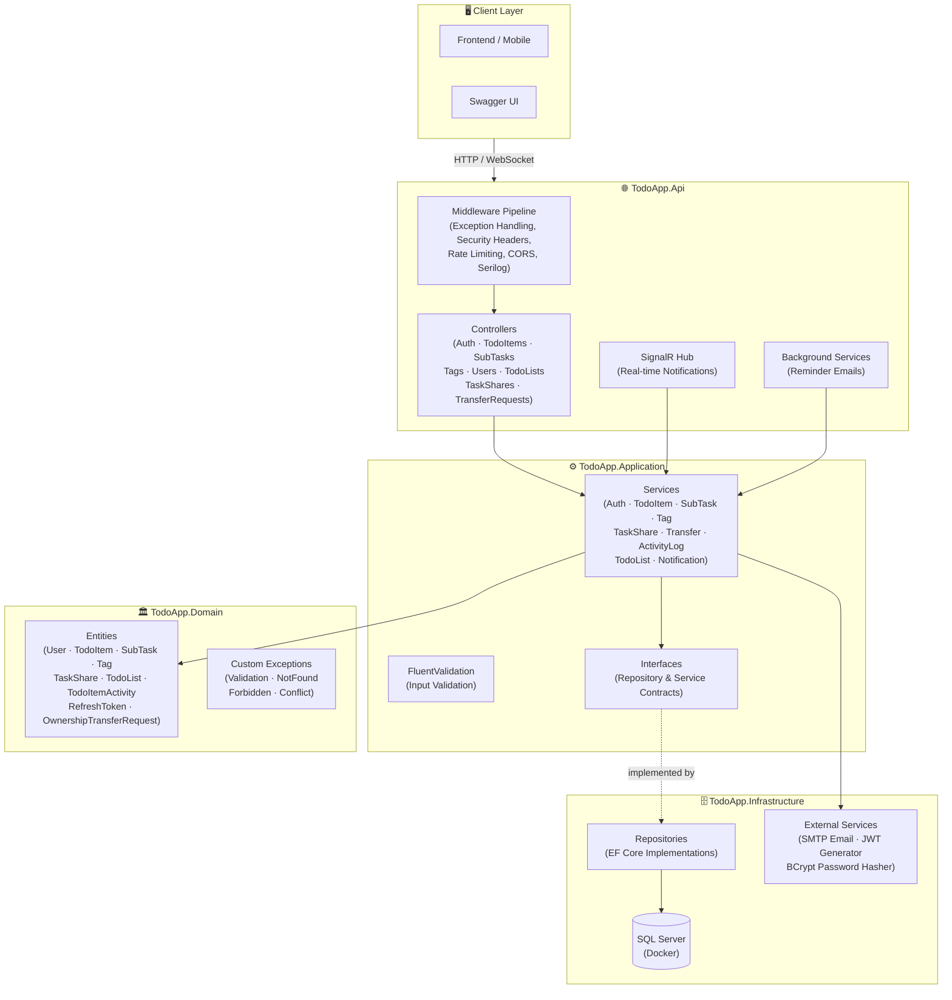
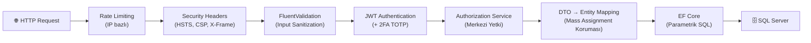

# 🗂️ TodoApp — Enterprise-Grade Task Management API


> Kurumsal seviyede görev yönetimi REST API'si. Gerçek zamanlı bildirimler (SignalR), iki faktörlü kimlik doğrulama (TOTP), rol tabanlı yetkilendirme, kapsamlı güvenlik önlemleri ve **197 otomatik test** ile production-ready backend altyapısı.

---

## 📐 Mimari

Proje, **Clean Architecture** prensiplerine uygun olarak 4 katmandan oluşmaktadır. Domain katmanı sıfır dış bağımlılığa sahiptir; Application katmanı yalnızca interface'lere bağımlıdır. Bu sayede iş mantığı, veritabanı teknolojisinden bağımsız olarak test edilebilir.



---

## ✨ Öne Çıkan Özellikler

### 🔐 Kimlik Doğrulama & Güvenlik

| Özellik | Açıklama | Motivasyon |
|---|---|---|
| **JWT + Refresh Token Rotasyonu** | Her token kullanımında eski iptal, yeni üretiliyor | Çalınan token'ın süresiz kullanımını engeller |
| **Refresh Token SHA-256 Hash** | DB'de düz metin yerine hash saklanıyor | Veritabanı sızıntısında token'lar ele geçirilemez |
| **İki Faktörlü Doğrulama (TOTP)** | Google Authenticator uyumlu 2FA akışı | Şifre tek başına yeterli değil — endüstri standardı |
| **Timing Attack Koruması** | Kullanıcı bulunamasa bile dummy hash hesaplanıyor | Yanıt süresinden email varlığı çıkarılamaz |
| **Rate Limiting** | Login 5/dk, Register 3/dk, Forgot Password 2/dk | Brute-force ve credential stuffing önlemi |
| **Security Headers** | HSTS, CSP, X-Frame-Options, X-Content-Type-Options | OWASP önerisi — tarayıcı seviyesinde koruma katmanı |
| **User Enumeration Önleme** | Forgot password'da her koşulda aynı mesaj | Kayıtlı email'ler tespit edilemez |
| **BCrypt DoS Koruması** | Şifre max 128 karakter sınırı | Aşırı uzun şifre ile hash hesaplama saldırısını engeller |

### 🏗️ Mimari & Tasarım Kararları

| Karar | Neden? |
|---|---|
| **Clean Architecture (4 katman)** | Bağımlılık yönü dıştan içe. Domain sıfır bağımlılık. Test edilebilirlik maksimum. |
| **DTO Pattern** | Kullanıcı girdisi doğrudan Entity'ye bağlanmaz — Mass Assignment (over-posting) saldırısı engellenir |
| **Merkezi Yetki Servisi** (`ITaskAuthorizationService`) | Tüm yetki kontrolleri tek noktada — endpoint'te kontrol unutulma riski minimize |
| **Options Pattern** | Magic string yerine `JwtSettings`, `SmtpSettings` gibi derleme zamanında doğrulanan tipli sınıflar |
| **RFC 7807 ProblemDetails** | Tüm hata yanıtları IETF standardında — frontend geliştiriciler evrensel format bekler |
| **Global Query Filter** | `IsDeleted` kontrolü EF Core seviyesinde otomatik — geliştirici unutması imkansız |
| **Sargable Index Seek** | `ToLower()` sorguları kaldırıldı, veri girişinde normalizasyon — DB index'leri verimli kullanılır |

### ⚡ Gerçek Zamanlı & Otomasyon

| Özellik | Açıklama |
|---|---|
| **SignalR WebSocket Hub** | Görev paylaşıldığında, güncellendiğinde veya tamamlandığında karşı tarafın ekranı canlı güncellenir |
| **Background Reminder Service** | `DueDate`'i yaklaşan görevler için otomatik email hatırlatıcısı (`BackgroundService`) |
| **Aktivite Denetim İzi (Audit Log)** | Görev üzerindeki tüm değişiklikler (oluşturma, güncelleme, paylaşma, tamamlama, silme) zaman çizelgesi olarak kaydedilir |

### 📋 Görev Yönetimi

| Özellik | Açıklama |
|---|---|
| **Alt Görevler (SubTasks)** | Her göreve max 50 alt görev eklenebilir (DoS koruması) |
| **Görev Paylaşımı** | Email ile paylaşım, paylaşılan kullanıcının çıkabilmesi, sahiplik devri onay mekanizması |
| **Etiketler (Tags)** | Admin tarafından yönetilen global etiketler, görevlere atanabilir |
| **Listeler / Kategoriler** | Görevler "İş", "Kişisel", "Proje X" gibi listeler altında gruplanabilir |
| **Dinamik Filtreleme & Arama** | Durum, öncelik, tarih aralığı, arama terimi, paylaşım tipi ve sıralama filtreleri |
| **Soft Delete & Çöp Kutusu** | Silinen görevler geri yüklenebilir, kalıcı silme ayrı endpoint |
| **Toggle Complete** | Tamamlanan görev tekrar açılabilir (SubTask ile tutarlı) |

---

## 📡 API Endpoints

**Toplam: 30+ endpoint** · Tüm korumalı endpoint'ler `Authorization: Bearer <JWT>` header'ı gerektirir.

<details>
<summary><strong>🔐 Kimlik Doğrulama (Auth)</strong></summary>

| Metod | Route | Açıklama | Yetki |
|---|---|---|---|
| `POST` | `/api/auth/register` | Kullanıcı kaydı | 🔓 Public |
| `POST` | `/api/auth/login` | Giriş (JWT üretimi) | 🔓 Public |
| `POST` | `/api/auth/login-2fa` | 2FA ile giriş | 🔓 Public |
| `POST` | `/api/auth/refresh` | Token yenileme (rotasyon) | 🔓 Public |
| `POST` | `/api/auth/logout` | Çıkış (token iptali) | 🔓 Public |
| `POST` | `/api/auth/forgot-password` | Şifre sıfırlama emaili | 🔓 Public |
| `POST` | `/api/auth/reset-password` | Şifre sıfırlama | 🔓 Public |
| `PUT` | `/api/auth/change-password` | Şifre değiştirme | 🔒 Auth |
| `POST` | `/api/auth/2fa/enable` | 2FA aktifleştir (QR kodu) | 🔒 Auth |
| `POST` | `/api/auth/2fa/verify` | 2FA doğrulama | 🔒 Auth |
| `POST` | `/api/auth/2fa/disable` | 2FA devre dışı bırak | 🔒 Auth |

</details>

<details>
<summary><strong>📝 Görev Yönetimi (TodoItems)</strong></summary>

| Metod | Route | Açıklama | Yetki |
|---|---|---|---|
| `GET` | `/api/todoitems` | Görevleri listele (filtreli, sayfalı) | 🔒 Auth |
| `POST` | `/api/todoitems` | Yeni görev oluştur | 🔒 Auth |
| `GET` | `/api/todoitems/{id}` | Görev detayı | 🔒 Owner/Shared |
| `PUT` | `/api/todoitems/{id}` | Görev güncelle | 🔒 Owner |
| `PATCH` | `/api/todoitems/{id}/complete` | Tamamla / Tekrar aç (Toggle) | 🔒 Owner |
| `DELETE` | `/api/todoitems/{id}` | Soft delete | 🔒 Owner |
| `DELETE` | `/api/todoitems/{id}/permanent` | Kalıcı silme | 🔒 Owner |
| `POST` | `/api/todoitems/{id}/restore` | Çöp kutusundan geri yükle | 🔒 Owner |
| `GET` | `/api/todoitems/trash` | Çöp kutusu | 🔒 Owner |
| `GET` | `/api/todoitems/{id}/activities` | Aktivite geçmişi (Audit Log) | 🔒 Owner/Shared |

</details>

<details>
<summary><strong>📎 Alt Görevler, Paylaşım, Etiketler, Listeler</strong></summary>

| Metod | Route | Açıklama | Yetki |
|---|---|---|---|
| `POST` | `/api/todoitems/{id}/subtasks` | Alt görev ekle | 🔒 Owner/Shared |
| `PATCH` | `/api/subtasks/{id}/complete` | Alt görev tamamla/aç | 🔒 Owner/Shared |
| `DELETE` | `/api/subtasks/{id}` | Alt görev sil | 🔒 Owner |
| `POST` | `/api/todoitems/{id}/shares` | Görevi paylaş | 🔒 Owner |
| `DELETE` | `/api/todoitems/{id}/shares/me` | Paylaşımdan çık | 🔒 Shared |
| `POST` | `/api/todoitems/{id}/transfer-requests` | Sahiplik devri talebi | 🔒 Owner |
| `POST` | `/api/tags` | Etiket oluştur | 🔒 Admin |
| `GET` | `/api/tags` | Etiketleri listele | 🔒 Auth |
| `CRUD` | `/api/todolists` | Liste yönetimi | 🔒 Auth |
| `DELETE` | `/api/users/me` | Hesap silme | 🔒 Auth |

</details>

> 📖 Tüm endpoint'lerin detaylı request/response örnekleri için: [`docs/api-endpoints.md`](docs/api-endpoints.md)

---

## 🛡️ Güvenlik Mimarisi

Proje geliştirme sürecinde **16 maddelik bir güvenlik denetimi** yapılmış ve tüm bulgular giderilmiştir (bkz. [`docs/security_audit.md`](docs/security_audit.md)).



| Saldırı Vektörü | Koruma Yöntemi | Durum |
|---|---|---|
| SQL Injection | EF Core parametrik sorgular | ✅ |
| XSS | `HtmlEncode` + REST API (Cookie-less) | ✅ |
| CSRF | Bearer Token (Cookie-less auth) | ✅ |
| Mass Assignment | DTO pattern | ✅ |
| Brute Force | Rate Limiting + (Account Lockout planlandı) | ✅ |
| Timing Attack | Dummy BCrypt hash | ✅ |
| Token Theft | Refresh token rotasyonu + SHA-256 hash | ✅ |
| User Enumeration | Sabit mesaj + sabit süre | ✅ |
| Privilege Escalation | `ITaskAuthorizationService` merkezi yetki | ✅ |
| Information Disclosure | Production'da genel hata mesajı | ✅ |
| DoS (Payload) | MaxLength + SubTask limit (50) | ✅ |

---

## ✅ Test Kapsamı

```
📦 185 Otomatik Test
├── 151 Unit Test (Birim Testi)
│   ├── 30 İş Kuralı Testi (BR-001 ~ BR-030)
│   ├── 35 FluentValidation Testi
│   ├── 20 Authorization Yetki Kombinasyonu
│   ├── 10 Sahiplik Devri Senaryosu
│   └── 56 Servis & Edge Case Testi
└── 34 Integration Test (Entegrasyon Testi)
    └── Gerçek DB ile Cascade/Constraint Doğrulama
```

- **Test Matrisi:** Tüm 30 iş kuralının hangi testle kapsandığı → [`docs/test_matrix.md`](docs/test_matrix.md)
- **Smoke Test Rehberi:** Swagger ile manuel test senaryoları → [`docs/smoke_test_guide.md`](docs/smoke_test_guide.md)

---

## 🗂️ Proje Yapısı

```
TodoApp/
├── src/
│   ├── TodoApp.Api/                  # Controllers, Middleware, Hubs, Background Services
│   ├── TodoApp.Application/          # Services, DTOs, Interfaces, Validators, Settings
│   ├── TodoApp.Domain/               # Entities, Enums, Custom Exceptions
│   └── TodoApp.Infrastructure/       # EF Core DbContext, Repositories, External Services
├── tests/
│   ├── TodoApp.Application.Tests/    # 151 Unit Tests (xUnit + Moq)
│   └── TodoApp.IntegrationTests/     # 34 Integration Tests (Real DB)
├── docs/
│   ├── api-endpoints.md              # Detaylı API dokümantasyonu
│   ├── business-rules.md             # 30 iş kuralı (BR-001 ~ BR-030)
│   ├── business-rules-layers.md      # Kuralların katman dağılımı
│   ├── security_audit.md             # 16 maddelik güvenlik denetim raporu
│   ├── test_matrix.md                # İş kuralı → Test eşleşme matrisi
│   ├── smoke_test_guide.md           # Manuel API test rehberi
│   ├── auth_workflows.md             # Kimlik doğrulama akış dokümanı
│   └── response_formats_guide.md     # API yanıt format standartları
├── backlog.md                        # 10 Epic, 25+ User Story, 100+ Task
├── docker-compose.yml                # SQL Server container
└── README.md                         # ← Bu dosya
```

---

## 🚀 Kurulum

### Gereksinimler
- [.NET 10 SDK](https://dotnet.microsoft.com/download)
- [Docker Desktop](https://www.docker.com/products/docker-desktop/) (SQL Server için)

### Adımlar

```bash
# 1. Repoyu klonla
git clone https://github.com/kullanici/TodoApp.git
cd TodoApp

# 2. SQL Server'ı Docker ile başlat
docker-compose up -d

# 3. User Secrets yapılandır (gizli bilgileri güvenle sakla)
cd TodoApp/src/TodoApp.Api
dotnet user-secrets set "Jwt:Key" "min-32-karakter-guclu-bir-anahtar-buraya"
dotnet user-secrets set "Jwt:Issuer" "TodoApp"
dotnet user-secrets set "Jwt:Audience" "TodoApp"
dotnet user-secrets set "ConnectionStrings:DefaultConnection" "Server=localhost,1433;Database=TodoAppDb;User Id=sa;Password=YourPassword123!;TrustServerCertificate=True"

# 4. Veritabanını oluştur (migration'ları uygula)
dotnet ef database update

# 5. Uygulamayı çalıştır
dotnet run

# 6. Swagger UI'ı aç
# → https://localhost:5001/swagger
```

### Testleri Çalıştır

```bash
cd TodoApp
dotnet test

# Beklenen çıktı:
# Başarılı! - Başarısız: 0, Başarılı: 151 - TodoApp.Application.Tests.dll
# Başarılı! - Başarısız: 0, Başarılı:  34 - TodoApp.IntegrationTests.dll
```

---

## 🔧 Teknik Zorluklar & Çözümler

<details>
<summary><strong>SQL Server Multiple Cascade Paths</strong></summary>

`TodoItem` tablosundaki 3 FK (`OwnerId`, `CompletedByUserId`, `DeletedByUserId`) aynı `Users` tablosuna işaret ettiğinde SQL Server birden fazla CASCADE yoluna izin vermez.

**Çözüm:** `OwnerId` → CASCADE, diğerleri → `NoAction` + kullanıcı silinirken manuel temizleme (`ExecuteUpdate` ile null'a çekme).
</details>

<details>
<summary><strong>SignalR JWT Token Taşıma</strong></summary>

WebSocket API'si HTTP header set etmeye izin vermediği için JWT token'ı `Authorization` header'ında gönderilemez.

**Çözüm:** JWT middleware'inin `OnMessageReceived` event'inde, `/hubs` rotası için `?access_token=` query parametresinden token okunması.
</details>

<details>
<summary><strong>BackgroundService ile Scoped Servisler</strong></summary>

`BackgroundService` singleton olarak çalışırken scoped servisler (`DbContext`, `IEmailSender`) doğrudan enjekte edilemez.

**Çözüm:** `IServiceScopeFactory` ile her iterasyonda yeni scope oluşturulması.
</details>

<details>
<summary><strong>Soft Delete & Global Query Filter</strong></summary>

Silinen görevlerin normal listede görünmemesi gerekiyor ama çöp kutusu endpoint'inde erişilebilir olmalı.

**Çözüm:** EF Core `HasQueryFilter(t => !t.IsDeleted)` ile otomatik filtreleme; çöp kutusu sorgularında `.IgnoreQueryFilters()` ile bypass.
</details>

---

## 📖 Dokümantasyon

| Doküman | Açıklama |
|---|---|
| [`docs/api-endpoints.md`](docs/api-endpoints.md) | Tüm 48 REST & Realtime endpoint'inin request/response ve yetki şeması |
| [`docs/business-rules.md`](docs/business-rules.md) | 30 iş kuralı tanımı (BR-001 ~ BR-030) ve veritabanı şeması |
| [`docs/business-rules-layers.md`](docs/business-rules-layers.md) | İş kurallarının DB vs Servis vs Hibrit katman haritası |
| [`docs/security_audit.md`](docs/security_audit.md) | 16 maddelik güvenlik & performans denetim raporu (tümü çözüldü) |
| [`docs/security_remediation_plan.md`](docs/security_remediation_plan.md) | İleri seviye güvenlik sertleştirmesi ve canlıya dağıtım iyileştirme rehberi |
| [`docs/test_matrix.md`](docs/test_matrix.md) | İş kuralı ↔ Test eşleşme matrisi (%100 yeşil) |
| [`docs/smoke_test_guide.md`](docs/smoke_test_guide.md) | 10 adımlı Swagger ve canlı ortam uçtan uca doğrulama rehberi |
| [`docs/FLUTTER_API_HANDBOOK.md`](docs/FLUTTER_API_HANDBOOK.md) | Flutter mobil geliştiriciler için mimari ve API el kitabı |
| [`docs/flutter_integration_guide.md`](docs/flutter_integration_guide.md) | Azure App Service ve Flutter istemci kurulum rehberi |
| [`docs/auth_workflows.md`](docs/auth_workflows.md) | Kimlik doğrulama ve görev akışlarının derinlemesine kod analizi |
| [`backlog.md`](backlog.md) | Epic ve User Story yol haritası |

---

## 📊 Proje İstatistikleri

| Metrik | Değer |
|---|---|
| Toplam Epic | 12 |
| Toplam User Story | 30+ |
| Toplam Task | 100+ |
| Otomatik Test | 197 (160 Unit + 37 Integration) |
| API Endpoint | 48 (REST + Real-time SignalR) |
| İş Kuralı | 30 (BR-001 ~ BR-030) |
| Güvenlik Denetim Maddesi | 16 (%100 giderildi) |
| Katman Sayısı | 4 (Clean Architecture) |

---

## 🛣️ Yol Haritası (Roadmap)

- [ ] Account Lockout (Hesap Kilitleme) — Botnet brute-force koruması
- [ ] JWT SecurityStamp — Anlık token iptali
- [ ] Refresh Token HttpOnly Cookie — XSS dayanıklılığı
- [ ] Background Queue — Aktivite log ve bildirim asenkronizasyonu
- [ ] Redis Backplane — SignalR scale-out desteği
- [ ] Otomatik Migration Pipeline — CI/CD entegrasyonu

> Detaylı yol haritası: [`backlog.md` → EPIC 10](backlog.md)

---

## 📄 Lisans

Bu proje [MIT](LICENSE) lisansı ile lisanslanmıştır.

